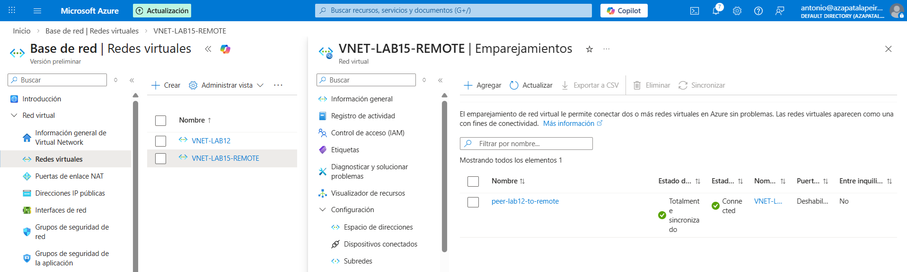

# Lab 15 - Interconexión de redes con VNet Peering

## Objetivo
Conectar dos redes virtuales (VNets) en Azure para que puedan comunicarse de forma privada usando direcciones IP internas, sin necesidad de exponer tráfico a Internet.

## Qué he hecho en este laboratorio
1. He creado una segunda VNet para simular otra red (por ejemplo otra sede o entorno).
2. He configurado peering en ambos sentidos (bidireccional) entre las dos VNets.
3. He validado que dos máquinas virtuales, una en cada VNet, se comunican usando únicamente IP privada.

## Configuración utilizada
- VNet principal: `VNET-LAB12` (con sus subredes existentes)
- VNet remota: `VNET-LAB15-REMOTE`
- Peering:
  - `peer-lab12-to-remote`
  - `peer-remote-to-lab12`
- VMs de prueba: 1 en cada VNet (solo para validación)

## Evidencias

### 01 - Peering en estado Connected

### 02 - Diagrama / vista de topología

### 03 - Prueba de conectividad por IP privada entre VNets

## Checklist de verificación
- [x] El peering aparece en estado Connected
- [x] Las máquinas virtuales se comunican usando IP privada entre VNets

## Qué le diría a un cliente o en entrevista
“Con VNet Peering conecto redes de forma privada y con baja latencia, evitando sacar tráfico a Internet. Es útil para comunicar entornos, sedes o servicios internos sin necesidad de exponerlos públicamente.”
